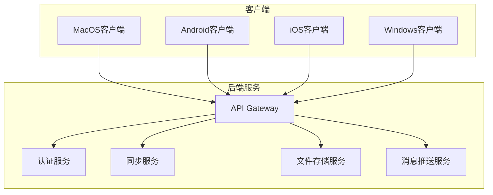
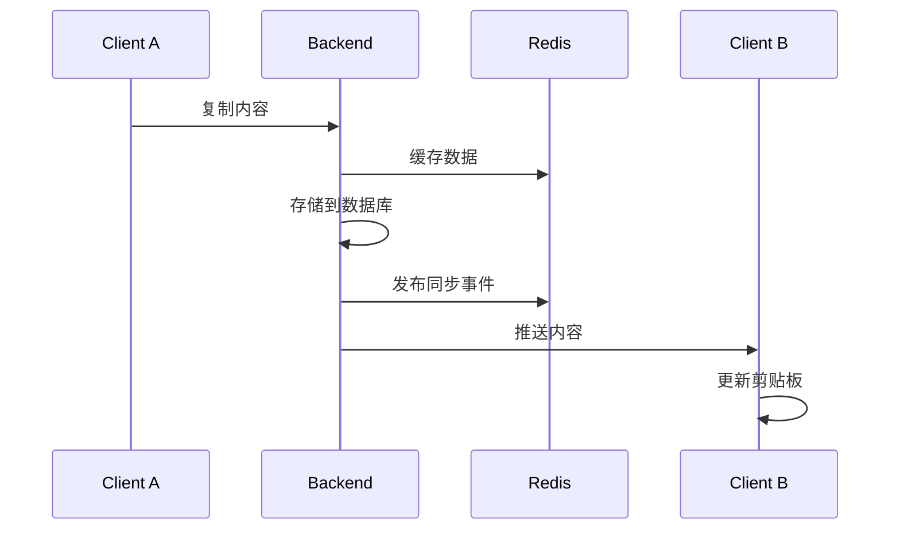

# 多端云剪贴板项目


## 项目概述

这是一个支持 MacOS、Android、iOS、Windows 多平台的云剪贴板同步解决方案。用户可以在任意设备上复制内容（文本、图片、文件），系统会自动将内容同步到其他已登录设备上。

## 核心特性

- 🔄 **实时同步**：跨平台剪贴板内容实时同步，延迟低于3秒
- 📱 **多平台支持**：支持 MacOS、Windows、Android、iOS 四大主流平台
- 🔒 **安全传输**：HTTPS/WSS 加密传输，支持端到端加密
- 📦 **多类型支持**：支持文本、图片、文件等多种内容类型
- 🎛️ **灵活配置**：可自定义文件大小限制、同步开关等
- 📊 **管理后台**：提供 Web 管理界面，方便管理用户和设备

## 技术架构

### 后端技术栈
- **语言**: Go 1.21+
- **Web框架**: Gin / Fiber
- **实时通信**: WebSocket (Gorilla)
- **数据库**: PostgreSQL 15+ 
- **缓存**: Redis 7+
- **文件存储**: MinIO / S3
- **消息队列**: RabbitMQ
- **容器化**: Docker + Kubernetes

### 客户端技术栈

| 平台 | 语言 | UI框架 | 核心技术 |
|------|------|--------|----------|
| MacOS | Swift | SwiftUI | NSPasteboard |
| Windows | C# (.NET 6+) | WPF/WinUI 3 | Clipboard API |
| Android | Kotlin | Jetpack Compose | LSPosed Hook |
| iOS | Swift | SwiftUI | UIPasteboard |

### Web管理后台
- **框架**: React 18 + TypeScript
- **UI**: Ant Design Pro
- **状态管理**: Redux Toolkit
- **构建工具**: Vite

## 项目文档

1. **[需求文档](docs/requirements.md)** - 详细的功能需求和非功能需求说明
2. **[技术方案](docs/technical-plan.md)** - 整体技术架构和各平台实现方案
3. **[后端实现指南](docs/backend-implementation-guide.md)** - 后端服务详细实现和代码示例
4. **[客户端实现指南](docs/client-implementation-guide.md)** - 各平台客户端详细实现方案
5. **[Web管理后台实现](docs/web-admin-implementation.md)** - 管理后台的实现方案

## 快速开始

### 方案3：纯静态文件部署 (推荐)

```bash
# 1. 构建前端静态文件
./build-static.sh

# 2. 启动后端服务
cd backend
ne cdocker-compose up -d

# 3. 部署静态文件到服务器 (生产环境)
sudo cp -r ./static-files/* /var/www/clipboard-sync/

# 4. 配置Caddy (生产环境)
sudo cp Caddyfile.production /etc/caddy/Caddyfile
sudo systemctl reload caddy
```

详细部署指南请参考: [DEPLOYMENT.md](DEPLOYMENT.md)

### 客户端构建

#### Windows 客户端 (推荐GitHub Actions)
```bash
# 方式1：GitHub Actions 自动构建 (推荐)
# 1. 前往 GitHub Actions 页面
# 2. 选择 "Build Windows Client (Manual)" 工作流程  
# 3. 点击 "Run workflow" 构建并下载

# 方式2：本地构建 (需要Windows环境)
cd clients/windows
dotnet build --configuration Release
dotnet publish --runtime win-x64 --self-contained true
```

#### MacOS 客户端
```bash
cd clients/macos
xcodebuild -project ClipboardSync.xcodeproj -configuration Release
```

#### Android 客户端
```bash
cd clients/android
./gradlew assembleRelease
```

#### 构建状态
- ✅ **Windows**: 支持GitHub Actions自动构建，可下载独立可执行文件
- ⏳ **MacOS**: 本地构建，计划增加GitHub Actions支持
- ⏳ **Android**: 本地构建，计划增加GitHub Actions支持
- ⏳ **iOS**: 本地构建，需要Apple开发者账号

## 开发计划

### Phase 1: 基础功能（2个月）
- ✅ 后端基础服务搭建
- ✅ 用户认证系统
- ✅ 文本同步功能
- ✅ Windows + Android 客户端

### Phase 2: 完善功能（1.5个月）
- ⏳ 图片、文件同步
- ⏳ MacOS + iOS 客户端
- ⏳ Web管理后台

### Phase 3: 优化提升（1.5个月）
- ⏳ 性能优化
- ⏳ 安全加固
- ⏳ 用户体验优化

## 系统架构图



## 同步流程



## 部署要求

### 服务器配置
- CPU: 8核以上
- 内存: 16GB以上
- 存储: 500GB SSD
- 带宽: 100Mbps以上
- 操作系统: Ubuntu 20.04 LTS

### 客户端要求
- MacOS: 10.15+
- Windows: Windows 10+
- iOS: 13.0+
- Android: 8.0+ (API 26+)

## 安全考虑

1. **传输安全**: 所有数据通过 HTTPS/WSS 加密传输
2. **存储安全**: 敏感数据加密存储，文件存储使用签名URL
3. **访问控制**: JWT Token 认证，设备绑定验证
4. **隐私保护**: 支持端到端加密，定期清理历史记录

## 贡献指南

欢迎提交 Issue 和 Pull Request。在提交代码前，请确保：

1. 代码通过所有测试
2. 遵循项目代码规范
3. 更新相关文档

## 许可证

本项目采用 MIT 许可证，详见 [LICENSE](LICENSE) 文件。

## 联系方式

- 项目主页: https://github.com/your-org/clipboard-sync
- 问题反馈: https://github.com/your-org/clipboard-sync/issues
- 邮箱: support@clipboard-sync.com 