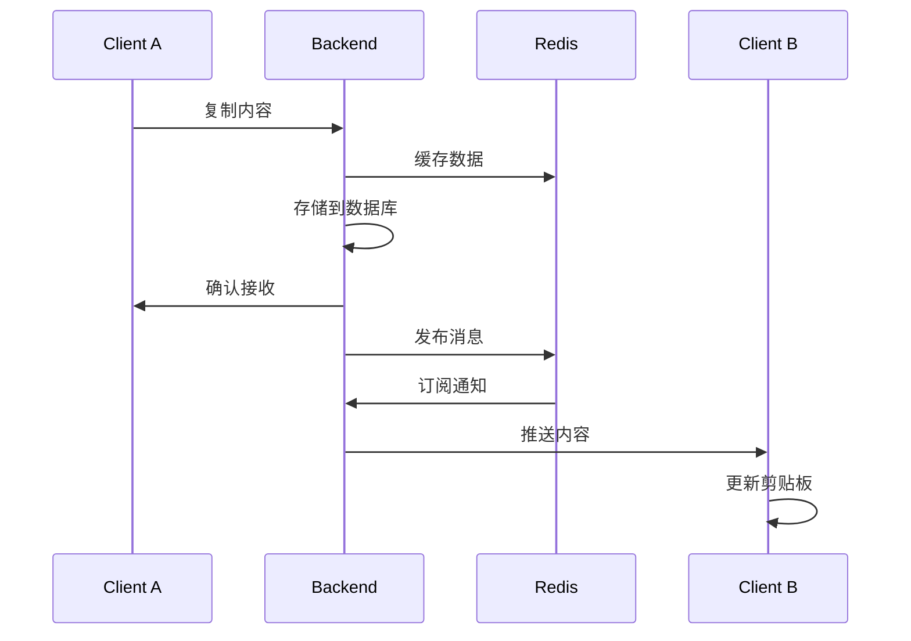

# 多端云剪贴板技术方案

## 1. 技术栈选择

### 1.1 后端技术栈

#### 核心框架
- **语言**: Go 1.21+
- **Web框架**: Gin / Fiber
- **WebSocket**: Gorilla WebSocket
- **认证**: JWT + OAuth2.0

#### 数据存储
- **主数据库**: PostgreSQL 15+
- **缓存**: Redis 7+
- **对象存储**: MinIO (自建) / AWS S3 (云端)
- **消息队列**: RabbitMQ

#### 基础设施
- **容器化**: Docker + Docker Compose
- **编排**: Kubernetes (K8s)
- **API网关**: Kong / Traefik
- **监控**: Prometheus + Grafana
- **日志**: ELK Stack (Elasticsearch + Logstash + Kibana)

### 1.2 各平台客户端技术栈

#### MacOS客户端
- **语言**: Swift 5.8+
- **UI框架**: SwiftUI
- **剪贴板监听**: NSPasteboard + NSPasteboardObserving
- **网络**: URLSession + Starscream (WebSocket)
- **数据存储**: Core Data + KeyChain
- **打包分发**: DMG + 公证

#### Windows客户端
- **语言**: C# (.NET 6+)
- **UI框架**: WPF / WinUI 3
- **剪贴板监听**: Windows.ApplicationModel.DataTransfer
- **网络**: HttpClient + WebSocketSharp
- **数据存储**: SQLite + Windows Credential Manager
- **打包**: MSIX / MSI

#### Android客户端
- **语言**: Kotlin
- **最低版本**: Android 8.0 (API 26)
- **架构**: MVVM + Clean Architecture
- **UI**: Jetpack Compose
- **剪贴板**: ClipboardManager + LSPosed Hook
- **网络**: Retrofit + OkHttp + Scarlet (WebSocket)
- **依赖注入**: Hilt
- **数据存储**: Room + DataStore

#### iOS客户端
- **语言**: Swift 5.8+
- **最低版本**: iOS 13.0+
- **UI框架**: SwiftUI + UIKit
- **剪贴板**: UIPasteboard (限制较多)
- **网络**: Alamofire + Starscream
- **数据存储**: Core Data + KeyChain
- **推送**: APNs

### 1.3 Web管理后台技术栈
- **框架**: React 18 + TypeScript
- **UI组件**: Ant Design Pro
- **状态管理**: Redux Toolkit
- **网络请求**: Axios + React Query
- **图表**: ECharts
- **构建工具**: Vite

## 2. 详细设计方案

### 2.1 后端架构设计

```yaml
# docker-compose.yml 示例结构
services:
  # API服务
  api-gateway:
    - 路由转发
    - 限流
    - 认证鉴权
  
  auth-service:
    - 用户注册/登录
    - JWT生成/验证
    - 设备管理
  
  sync-service:
    - 剪贴板数据同步
    - WebSocket连接管理
    - 消息推送
  
  storage-service:
    - 文件上传/下载
    - 图片压缩
    - 存储管理
  
  # 基础设施
  postgres:
    - 用户数据
    - 设备信息
    - 同步记录
  
  redis:
    - 会话缓存
    - 在线状态
    - 消息队列
  
  rabbitmq:
    - 异步消息
    - 事件驱动
  
  minio:
    - 文件存储
    - 图片存储
```

### 2.2 数据库设计

```sql
-- 用户表
CREATE TABLE users (
    id UUID PRIMARY KEY,
    email VARCHAR(255) UNIQUE NOT NULL,
    password_hash VARCHAR(255) NOT NULL,
    created_at TIMESTAMP DEFAULT NOW(),
    updated_at TIMESTAMP DEFAULT NOW()
);

-- 设备表
CREATE TABLE devices (
    id UUID PRIMARY KEY,
    user_id UUID REFERENCES users(id),
    device_name VARCHAR(255),
    device_type VARCHAR(50), -- 'macos', 'windows', 'android', 'ios'
    device_id VARCHAR(255) UNIQUE,
    last_active TIMESTAMP,
    created_at TIMESTAMP DEFAULT NOW()
);

-- 剪贴板记录表
CREATE TABLE clipboard_items (
    id UUID PRIMARY KEY,
    user_id UUID REFERENCES users(id),
    device_id UUID REFERENCES devices(id),
    content_type VARCHAR(50), -- 'text', 'image', 'file'
    content TEXT, -- 文本内容或文件元信息
    file_url VARCHAR(500), -- 文件/图片URL
    file_size BIGINT,
    created_at TIMESTAMP DEFAULT NOW()
);

-- 同步记录表
CREATE TABLE sync_logs (
    id UUID PRIMARY KEY,
    item_id UUID REFERENCES clipboard_items(id),
    from_device UUID REFERENCES devices(id),
    to_device UUID REFERENCES devices(id),
    status VARCHAR(50),
    synced_at TIMESTAMP DEFAULT NOW()
);
```

### 2.3 API设计

```yaml
# RESTful API
POST   /api/auth/register
POST   /api/auth/login
POST   /api/auth/refresh
POST   /api/auth/logout

GET    /api/devices
POST   /api/devices
DELETE /api/devices/{id}

POST   /api/clipboard/sync
GET    /api/clipboard/history
DELETE /api/clipboard/{id}

POST   /api/files/upload
GET    /api/files/{id}

# WebSocket
WS     /ws/sync
```

### 2.4 实时同步流程



## 3. 各平台实现细节

### 3.1 Android客户端 (使用LSPosed)

```kotlin
// LSPosed Hook 模块示例
@HookClass
class ClipboardHook {
    @MethodHook
    fun hookSetPrimaryClip(param: MethodParam) {
        val clip = param.args[0] as ClipData
        // 发送到同步服务
        SyncService.syncClipboard(clip)
    }
}

// 前台服务保活
class ClipboardSyncService : Service() {
    override fun onStartCommand(intent: Intent?, flags: Int, startId: Int): Int {
        startForeground(NOTIFICATION_ID, createNotification())
        return START_STICKY
    }
}
```

### 3.2 MacOS客户端

```swift
// 剪贴板监听
class ClipboardMonitor {
    private var changeCount: Int
    private var timer: Timer?
    
    func startMonitoring() {
        changeCount = NSPasteboard.general.changeCount
        timer = Timer.scheduledTimer(withTimeInterval: 0.5, repeats: true) { _ in
            self.checkForChanges()
        }
    }
    
    private func checkForChanges() {
        let currentChangeCount = NSPasteboard.general.changeCount
        if currentChangeCount != changeCount {
            changeCount = currentChangeCount
            handleClipboardChange()
        }
    }
}
```

### 3.3 Windows客户端

```csharp
// 剪贴板监听
public class ClipboardMonitor : IDisposable
{
    private readonly Window _window;
    
    public ClipboardMonitor()
    {
        _window = new Window();
        _window.SourceInitialized += OnSourceInitialized;
    }
    
    private void OnSourceInitialized(object sender, EventArgs e)
    {
        var source = PresentationSource.FromVisual(_window) as HwndSource;
        source?.AddHook(WndProc);
        NativeMethods.AddClipboardFormatListener(source.Handle);
    }
    
    private IntPtr WndProc(IntPtr hwnd, int msg, IntPtr wParam, IntPtr lParam, ref bool handled)
    {
        if (msg == WM_CLIPBOARDUPDATE)
        {
            OnClipboardChanged();
            handled = true;
        }
        return IntPtr.Zero;
    }
}
```

### 3.4 iOS客户端

```swift
// iOS剪贴板访问（受限）
class ClipboardManager {
    // iOS 14+ 需要用户授权
    func checkClipboard() {
        if UIPasteboard.general.hasStrings {
            // 需要用户确认才能访问
            requestClipboardAccess { granted in
                if granted {
                    let content = UIPasteboard.general.string
                    self.syncToCloud(content)
                }
            }
        }
    }
    
    // 使用App Groups共享数据
    func shareViaAppGroup() {
        let sharedDefaults = UserDefaults(suiteName: "group.com.example.clipboard")
        sharedDefaults?.set(clipboardData, forKey: "shared_clipboard")
    }
}
```

## 4. 开发计划

### 4.1 第一阶段（8周）

#### 第1-2周：后端基础搭建
- [ ] 项目初始化，搭建开发环境
- [ ] 数据库设计和初始化
- [ ] 用户认证服务开发
- [ ] 基础API框架搭建

#### 第3-4周：核心同步服务
- [ ] WebSocket服务开发
- [ ] 消息队列集成
- [ ] 文件存储服务
- [ ] 同步逻辑实现

#### 第5-6周：Windows客户端
- [ ] 项目框架搭建
- [ ] 剪贴板监听功能
- [ ] WebSocket客户端
- [ ] UI界面开发

#### 第7-8周：Android客户端
- [ ] LSPosed模块开发
- [ ] 主应用开发
- [ ] 服务保活机制
- [ ] Material Design UI

### 4.2 第二阶段（6周）

#### 第9-10周：MacOS客户端
- [ ] Swift项目搭建
- [ ] 剪贴板监听
- [ ] 菜单栏应用
- [ ] 系统集成

#### 第11-12周：iOS客户端
- [ ] 项目搭建
- [ ] 剪贴板访问适配
- [ ] 推送通知集成
- [ ] SwiftUI界面

#### 第13-14周：Web管理后台
- [ ] React项目搭建
- [ ] 用户管理界面
- [ ] 设备管理界面
- [ ] 数据统计图表

### 4.3 第三阶段（6周）

#### 第15-16周：功能完善
- [ ] 端到端加密
- [ ] 离线同步
- [ ] 历史记录功能
- [ ] 批量操作

#### 第17-18周：性能优化
- [ ] 后端性能调优
- [ ] 客户端优化
- [ ] 压力测试
- [ ] 安全审计

#### 第19-20周：部署上线
- [ ] CI/CD搭建
- [ ] 生产环境部署
- [ ] 监控告警配置
- [ ] 文档编写

## 5. 关键技术点

### 5.1 实时性保证
- WebSocket长连接 + 心跳机制
- Redis发布订阅实现消息推送
- 客户端断线重连机制

### 5.2 大文件处理
- 分片上传/下载
- 断点续传
- CDN加速

### 5.3 安全性
- HTTPS/WSS加密传输
- JWT Token认证
- 文件URL签名防盗链
- 敏感内容过滤

### 5.4 跨平台兼容
- 统一的数据协议
- 平台特性适配
- 降级方案

## 6. 测试计划

### 6.1 单元测试
- 后端服务覆盖率 > 80%
- 客户端核心逻辑测试

### 6.2 集成测试
- API接口测试
- 多平台同步测试
- 压力测试

### 6.3 用户测试
- Alpha测试（内部）
- Beta测试（邀请制）
- 正式发布 